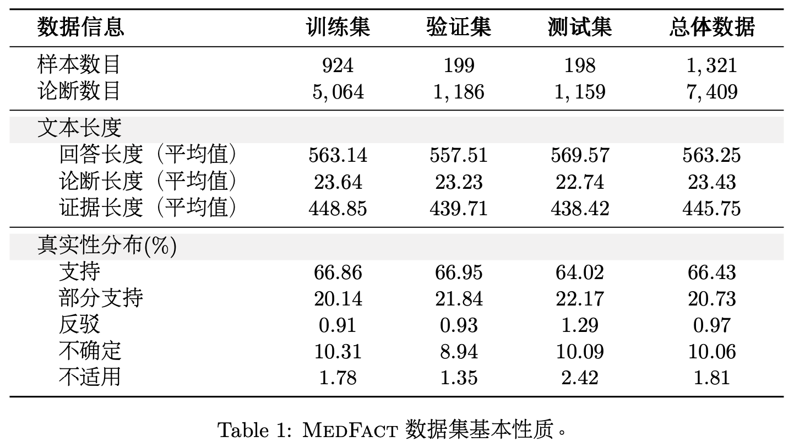
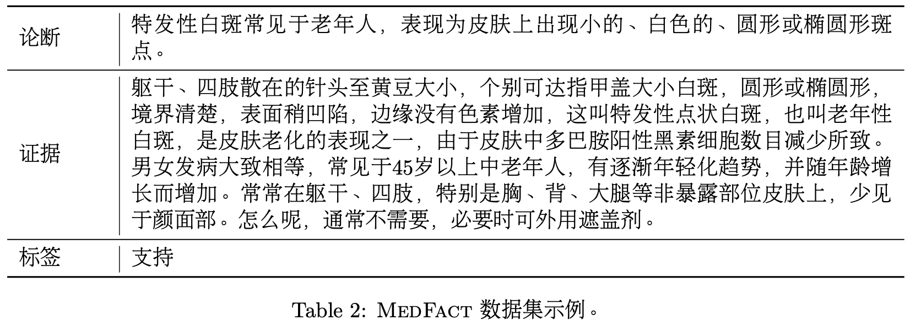

# MedFact: A Large-scale Chinese Dataset for Evidence-based Medical Fact-checking of LLM Responses
## 任务简介 | Task Introduction
 
循证事实核查（Evidence-based Medical Fact-checking）是一项旨在验证在线医疗内容真实性的关键任务。随着互联网成为公众获取医疗健康信息的主要渠道，医疗虚假信息的泛滥给公共卫生安全带来了严峻挑战。该任务要求模型不仅要理解医疗声明（Claim），还需要结合检索到的相关证据（Evidence），判断证据对声明的支持程度（如支持、反驳或证据不足）。这一过程对于提高医疗信息的透明度、减少误导性信息的传播具有不可替代的作用，同时也是构建可信赖的医疗问答系统和智能医疗助手的核心安全屏障。
 
Evidence-based Medical Fact-checking is a critical task aimed at verifying the authenticity of online medical content. As the Internet becomes the primary channel for the public to access healthcare information, the proliferation of medical misinformation poses serious challenges to public health security. This task requires models not only to understand medical claims (Claims), but also to combine retrieved relevant evidence (Evidence) to determine the degree to which the evidence supports the claim (e.g., supported, refuted, or insufficient evidence). This process plays an irreplaceable role in improving the transparency of medical information and reducing the spread of misleading information, and is also a core safety barrier for building trustworthy medical question-answering systems and intelligent medical assistants.

---
 
## 任务定义 | Task Definition
 
任务的具体目标定义如下：给定一组由大语言模型生成的医疗论断 $C = \{c_1, c_2, \ldots, c_n\}$ 及其对应的证据 $E = \{e_1, e_2, \ldots, e_n\}$，其中 $c_i$ 是第 $i$ 个论断，$e_i$ 是其对应的证据，任务的目标是学习一个函数 $f: C \times E \rightarrow \mathcal{L}$，其中集合 $\mathcal{L} = \{支持,\ 部分支持,\ 反驳,\ 不确定,\ 不适用\}$。对于每一对 $(c_i, e_i)$，模型应预测正确的标签（即真实性）$y_i = f(c_i, e_i) \in \mathcal{L}$，从而判断证据支持或反驳该论断的程度。
 
The specific goal of the task is defined as follows: given a set of medical claims generated by large language models $C = \{c_1, c_2, \ldots, c_n\}$ and their corresponding evidence $E = \{e_1, e_2, \ldots, e_n\}$, where $c_i$ is the $i$-th claim and $e_i$ is its corresponding evidence, the goal is to learn a function $f: C \times E \rightarrow \mathcal{L}$, where the label set $\mathcal{L} = \{\text{Supported},\ \text{Partially Supported},\ \text{Refuted},\ \text{Uncertain},\ \text{Not Applicable}\}$. For each pair $(c_i, e_i)$, the model should predict the correct label (i.e., veracity) $y_i = f(c_i, e_i) \in \mathcal{L}$, thereby determining the extent to which the evidence supports or refutes the claim.

### 标签说明 | Label Descriptions
 
| 标签 | Label | 说明 |
|---|---|---|
| **支持** | Supported | 证据完全支持声明的内容 / Evidence fully supports the claim |
| **部分支持** | Partially Supported | 证据支持声明的部分内容，但存在不确定性或未覆盖的细节 / Evidence supports part of the claim but with uncertainty or uncovered details |
| **反驳** | Refuted | 证据与声明内容相矛盾 / Evidence contradicts the claim |
| **不确定** | Uncertain | 证据与声明相关，但不足以证实或反驳声明的真实性 / Evidence is related but insufficient to confirm or refute the claim |
| **不适用** | Not Applicable | 证据与声明完全不相关 / Evidence is completely irrelevant to the claim |
 
---
 
## 测评数据 | Dataset
 
本次评测使用的 **MEDFACT** 数据集包含 **1,321 个医学问题**和 **7,409 条医疗论断**。该数据集经过精心划分，按 **70% : 15% : 15%** 的比例分割，以确保各子集之间的独立性。
 
The **MEDFACT** dataset used in this evaluation contains **1,321 medical questions** and **7,409 medical claims**. The dataset is carefully split in a ratio of **70% : 15% : 15%** to ensure independence between subsets.

### 数据统计 | Dataset Statistics

### 数据集示例 | Dataset Example

## 评价标准 | Evaluation Metrics
 
基于 MEDFACT 论文的实验设置和数据分布特点，我们将使用 **Macro-F1** 作为最终成绩的评价标准。在面向参赛者的排行榜中，我们也会展示以下指标，帮助参赛者更好地优化模型：
 
Based on the experimental setup and data distribution of the MEDFACT paper, **Macro-F1** will be used as the primary evaluation metric for final rankings. The following additional metrics will also be displayed on the leaderboard to help participants better optimize their models:
 
- **Macro-F1**（主要指标 / Primary Metric）
- Accuracy
- Macro Precision
- Macro Recall
- Per-class F1-Score
---

## 评测赛程 | Schedule （暂定）

- **评测任务发布 / Task Release**：2026/02/01
- **报名时间 / Registration**：2026/02/01 – 2026/06/10
- **训练集发布 / Training Set Release**：2026/04/01
- **测试集 A 榜发布 / Test-A Release**（非最终测试集，不计分 / Unranked）：2026/04/11
- **测试集 A 榜提交截止 / Test-A Submission Deadline**：2026/06/11
- **测试集 B 榜发布 / Test-B Release**（即最终排名成绩 / Official Final Ranking）：2026/06/21
- **测试集 B 榜提交截止 / Test-B Submission Deadline**：2026/06/30
- **获奖队伍提交材料 / Award Qualification Submission**（核实无误即可获得颁奖资格，不合格者延顺 / Disqualified teams will be replaced in order）：2026/07/01 – 2026/07/09
- **提交中英文技术报告 / Technical Report Submission**：2026/07/10
- **公布颁奖队伍 / Award Announcement**：2026/07/20
- **评测论文审稿 & 录用通知 / Paper Review & Acceptance Notification**：2026/07/25
- **评测论文 Camera-Ready 版提交 / Camera-Ready Submission**：2026/08/15
- **评测论文纠错排版 & 提交 ACL/CCL Anthology 收录 / Anthology Submission**：2026/09/15
- **CCL 2026 技术评测研讨会 / CCL 2026 Evaluation Workshop**：2026/10

## 任务奖项 | Awards
 
本届评测将设置**一、二、三等奖**，由**中国中文信息学会**提供荣誉证书。
 
---

## 网站建设与论文评审 | Website & Paper Review
 组织方正在计划开设一个leaderboard网站，网站上线后将承担报名和结果提交等功能。

---
